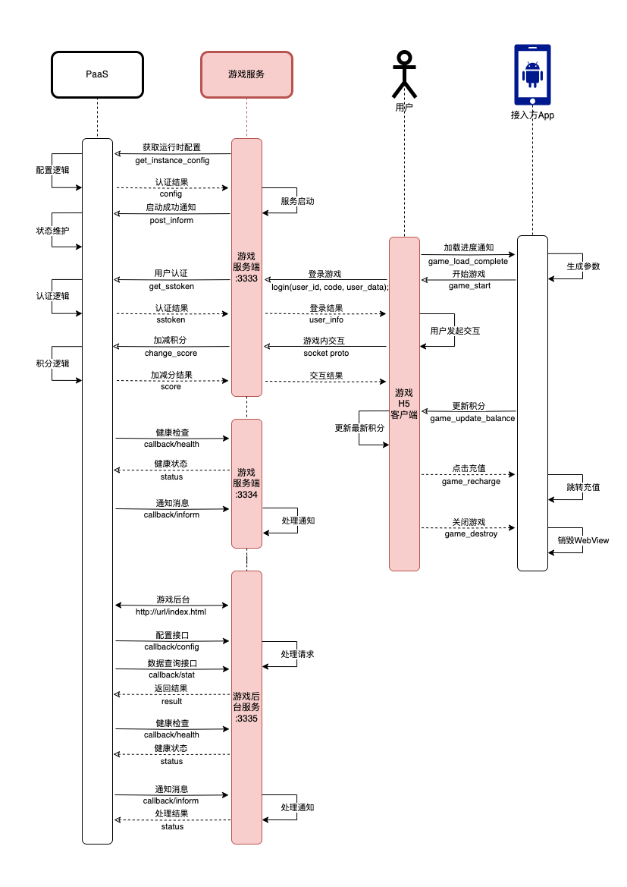

## 概述

目前游戏PaaS平台只支持H5客户端。开发者按PaaS要求，提供游戏服务端、游戏后台、H5客户端。审核通过后，即可接入PaaS平台。
游戏服务端、游戏后台，仅需提供编译好的二进制文件及完整的服务启动命令。H5客户端，提供打包好的静态资源文件。

> 注意：
> 1. 游戏服务暂不提供PHP等脚本语言运行环境，暂时仅支持通过二进制直接启动的运行方式。
> 2. 游戏服务运行所使用的数据库、缓存，目前只支持MySQL和Redis。
> 3. 本文档中的源码均为做逻辑说明的伪代码，供参考。

## 工作流程图



## 开发说明

### 客户端

#### 开发指引

游戏H5，通过调用接入方App实现的js函数与其进行交互。

需要实现的js函数：
1. game_start 游戏开始
2. game_update_balance 更新游戏内积分余额

> TODO: 补充App交互函数的实现方法，或增加链接跳转说明页面

参考工作流程图，当接入方App通过WebView的形式打开游戏H5链接时，游戏H5客户端开始运行。
当游戏进入loading页面时（跳过游戏引擎的splash画面后），通过 game_load_complete 通知App：
```typescript
App.game_load_complete('load_started');
```
此时App可展示WebView，游戏内则进入加载画面。当游戏加载完成后，通知App：
```typescript
App.game_load_complete('load_completed');
```
当App收到 load_completed 通知后，即可调用 game_start 方法，传递必要参数，继续游戏流程。
game_start 方法的参数中，包含游戏登录等需要的参数。
```typescript
param = {
	user_id: '100001', //用户ID
	code: 'xeihkfk88ekk1s', //认证码
	server_addr: 'wss://3sdk.com/gameserver', //游戏服务socket地址
	user_data: '' //接入方App自定义数据
}
```
游戏收到 game_start 调用后，解析这些参数，并通过游戏内协议，发送给游戏服务端进行用户认证。认证通过后，可继续游戏流程（以下为伪代码）：
```typescript
//连接socket
socket.ConnectToServer(param.server_addr, 'arraybuffer', 'login');

//socket连接成功后，发送登录请求
socket.Send({
	"user_id": '100001',
	"code": 'xeihkfk88ekk1s',
	"user_data": ''
	...
}, 'login');
```
登录成功后，后续的游戏流程，即正常的游戏内逻辑交互。

这里需要补充一点的是，除了上述方案以外，开发者还需实现另一种兼容方案，即通过URL参数获得所需参数的方式。接入方在WebView中打开游戏链接时，可以通过URL传入游戏登录参数，比如：
```typescript
app.WebView.OpenUrl('https://path_to_game_h5_url/game_client/v1.0/index.html?user_id=100001&code=xeihkfk88ekk1s&server_addr=d3NzOi8vM3Nkay5jb20vZ2FtZXNlcnZlcg%3D%3D&score_icon=aHR0cHM6Ly9wYXRoX3RvX2N1cnJlbmN5X2ljb24vaWNvbi5wbmc%3D&language=en-US&user_data=');
```
当游戏 load_completed 以后，通过此种方式获得了有效的参数，即可直接使用这些参数，继续游戏流程，无需再等待App调用 game_start 传参（后续的 game_start 可忽略）。

> 注意：
> 1. 此种传参方式，要对所有字符串先进行urldecode解码，再base64解码。
> 2. 积分图标(score_icon)和语言(language)两个参数，都需要通过解析URL参数的方式获取。并对应实现替换积分图标icon和选择对应语言（如果支持多语言）的功能。

#### 打包发布

以cocos creator为例，开发者仅需提供打包好的、包含index.html文件的完整文件夹即可。

#### 布局支持

H5游戏客户端，需要支持两种布局，且根据WebView的分辨率比例自动切换。当宽高比(宽/高) <= 0.56 时（或高宽比(高/宽) >= 1.8）时，使用全屏铺满布局。否则，应自动切换至半屏布局。
以下以cocos creator为例，给出一种实现方法：
```typescript
//loading过程中判断高宽比
let screenSize = screen.windowSize;
let aspectRatio = screenSize.height/screenSize.width;
let sceneName = 'scene-half'; //默认半屏 如果高宽比>=1.8 则使用全屏布局
if (aspectRatio >= 1.8) {
	sceneName = 'scene-full'; //提供两种布局场景文件 scene-half(半屏) 和 scene-full(全屏) 即可
}
assetManager.main.loadScene(sceneName, self.onProgress.bind(self), self.onCompleted.bind(self));
```

### 服务端

#### 游戏启动

PaaS在启动游戏服务时，会通过命令行参数的形式将必要参数传递给开发者，这些参数包括：
```go
var api_paas_config string //PaaS提供的获取运行环境配置的接口地址
var instance_id string //当前启动的实例ID
```
以golang为例解析这些参数：
```go
flag.StringVar(&apiConfig, "api_paas_config", "https://xx", "-api_paas_config https://xx") //api_paas_config 获取游戏运行时配置的API接口
flag.StringVar(&instanceId, "instance_id", "", "-instance_id 1234567890") //instance_id 游戏实例ID
```
拿到这两个参数以后，通过 api_paas_config 和 instance_id 向PaaS获取运行时配置：
```go
//请求参数
type InstanceConfigRequest struct {
	InstanceID string `json:"instance_id"`
}

//构造请求参数
req := InstanceConfigRequest{
	InstanceID: instanceId,
}

//请求运行时参数
r, _ := json.Marshal(req)
http.Post("api_paas_config", string(req))

//以下为调用成功后的返回结果

//获得运行时参数类似如下
"mysql": {
	"host": "127.0.0.1",
	"port": 3306,
	"username": "root",
	"password": "123456",
	"database": "gamex"
},
"redis": {
	"host": "127.0.0.1",
	"port": 6379,
	"username": "",
	"password": "123456",
	"database": 0
},
"apis": {
	"api_post_inform": "https://...", //向PaaS发布通知消息接口
	"api_get_sstoken": "https://...", //用户认证接口
	"api_update_sstoken": "https://...", //更新sstoken接口
	"api_get_userinfo": "https://...", //获取用户信息接口
	"api_get_score": "https://...", //获取用户积分接口
	"api_change_score": "https://..." //加减积分接口
}
...
```
拿到这些游戏实例的运行时配置，即可连接对应的资源服务。并在游戏中使用交互API进行后续步骤的交互。
> 注意：PaaS要求，游戏socket服务应总是监听3333端口（游戏逻辑服务），并同时监听3334端口（处理PaaS的Web回调）。

#### 用户认证

当收到客户端登录请求，并得到客户端传递的必要参数后(socket协议)，服务端通过 get_sstoken 接口做用户认证：
```go
//构造请求参数
req := SSTokenRequest{
	UserID: userId,
	Code: code,
	InstanceID: instanceID,
	UserData: userData,
}

//请求认证
r, _ := json.Marshal(req)
http.Post("https://...", string(r)) //api_get_sstoken

//获得认证结果
{
	"ss_token": "5cb2258d8801a7c0737d5b60d0e2fdf5",
	"expire_at": 1744169754,
	"user_data": ""
}
...
```
用户认证完成后，该用户即可在游戏中进行其他操作，后续操作都需要传递这一步获取到的sstoken。
> TODO: 详细接口说明参考链接-->。

#### 刷新sstoken

在一定的有效期内（一般为3天），可以通过 update_sstoken 接口刷新sstoken，获得更长的有效期。
> TODO: 详细接口说明参考链接-->。

#### 获取用户信息

通过 get_user_info 接口，可以通过用户ID获取用户信息。
> TODO: 详细接口说明参考链接-->。

#### 获取用户积分

通过 get_score 接口，可以通过用户ID获取用户积分。
> TODO: 详细接口说明参考链接-->。

#### 用户加减分

通过 change_score 接口，可以对用户进行加减积分操作。
游戏逻辑，应该对加减积分的成功与否负责。比如，某一回合游戏中，扣分成功，却在结算阶段由于某种异常导致未给胜利的用户结算成功(加分)，则需要游戏维护一个结算失败的重试机制，保证用户最终结算成功。
> TODO: 详细接口说明参考链接-->。

#### 回调接口

游戏服务端需要通过3334端口实现两个PaaS的回调接口：
1. :3334/callback/health 健康检查接口
2. :3334/callback/inform 通知接口
> TODO: 详细接口说明参考链接-->。

### 游戏后台

#### 后台页面

游戏后台需要提供一个配置游戏和查询游戏数据的可视化web页面。比如 :3335/ 打开游戏后台。
除可视化配置游戏以外，建议提供一个游戏的数据查询、汇总页面，提供给接入方通过用户ID查询游戏数据，以及汇总游戏数据。

#### 配置接口

游戏后台提供的可视化配置、查询游戏数据功能，对应的提供API接口，以方便接入方将后台功能集成到其业务后台中。
1. :3335/callback/config 配置接口
2. :3335/callback/stat 数据查询接口

#### 回调接口

同样的，游戏后台服务也需要通过3335端口实现两个PaaS的回调接口：
1. :3335/callback/health 健康检查接口
2. :3335/callback/inform 通知接口

> 注意：PaaS要求游戏后台服务须总是监听在3335端口。

### 服务打包

游戏服务和后台服务，均以一个独立的文件夹发布，其中需包含服务程序的二进制文件。包括配置文件、日志文件、静态文件等所有文件，都应在当前目录下（可以是子目录或更深的目录，但不能在此目录之外）。
### 服务更新

发布一个游戏包含两个服务程序，游戏服务端和游戏后台。
当游戏服务端有新的版本更新时，为保障用户数据安全，避免未结算情况的发生，PaaS将在游戏服务端明确告知，可以进行维护操作时，进行版本升级及服务重启维护。

当接入方通过PaaS后台操作更新/维护计划，PaaS将通过inform接口（:3334/callback/inform）通知实例，类型为 maintenance_schedule：
```go
http.Post('https://abc:3334/callback/inform', {
	...
	"type": "maintenance_schedule",
	"data": {
		"schedule_id": "xxxx",
	    "timestamp_start": "1744779943",
	    "timestamp_end": "1744779943",
	    "note": "版本升级"
	}
	...
})
```
具体参考inform接口说明。

收到该回调通知以后，游戏需要在开始维护时间后，在游戏结算完成时，将游戏置为维护状态（即不可再继续游戏，并通知客户端），通过 post_inform 接口向PaaS发送可维护更新的通知：
```go
http.Post('https://abc/post_inform', {
	"instance_id": "xxxx",
	"type": "instance_status_can_maintain",
	"data": {
		"schedule_id": "xxxx",
	}
	...
})
```
PaaS在收到该通知后，即开始更新维护，并重启服务。

> 游戏后台的更新，因为不影响用户数据，可以直接更新。接入方在PaaS选择升级操作时，会提示是否需要中断服务。