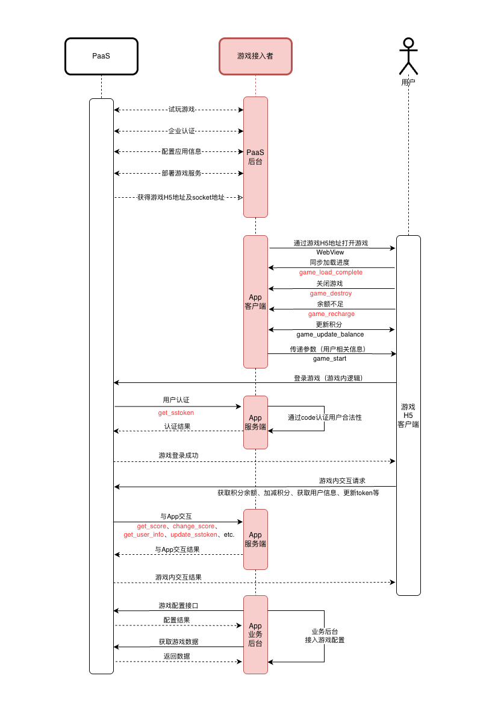

## 接入流程图



## 开发需要

### 客户端

游戏H5，与本地App通过调用App实现的js函数进行交互。

> TODO: 补充App交互函数的实现方法，或增加链接跳转说明页面

需要实现的函数：
1. game_load_complete 游戏加载完毕通知
2. game_load_progress 加载进度通知
3. game_destroy 关闭游戏
4. game_recharge 余额不足/点击充值
5. game_update_balance 游戏内发起更新余额

按上图工作流程，App在WebView中打开游戏H5链接，当游戏开始loading的时候，会收到通知（类型为"load_started"）：
```typescript
1. appJS.game_load_complete('load_started');
//App可以在收到此通知后，显示WebView，以跳过引擎的splash画面
appJS.game_load_complete('load_completed');
//当游戏加载完毕，真正进入游戏主页面时（可登录），同样会收到通知
```
加载过程中，游戏会发送加载进度通知：
```typescript
2. appJS.game_load_progress(progress);
//如果App WebView希望统一游戏加载风格，可通过此通知，自定义加载进度画面
```
当用户退出游戏或关闭游戏：
```typescript
3. appJS.game_destroy();
//收到此调用，App关闭WebView
```
当游戏内余额不足时，通知App：
```typescript
4. appJS.game_recharge(type);
//通知App，App根据参数类型可选择弹出充值页面
```
游戏内余额发生变化时，通知App：
```typescript
5. appJS.game_update_balance(balance);
//App可根据此参数，更新App内用户的当前余额
```

#### 参数说明

| 参数名            | 类型     | 解析途径     | 使用说明         |
| -------------- | ------ | -------- | ------------ |
| user_id        | string | URL或JS函数 | 用户唯一ID       |
| code           | string | URL或JS函数 | 接入者提供的认证码    |
| server_addr    | string | URL或JS函数 | 游戏socket连接地址 |
| user_data      | string | URL或JS函数 | 自定义数据（高级用法）  |
| score_icon     | string | URL      | 积分图标图片URL    |
| score_icon_ext | string | URL      | 积分图标的图片后缀名   |
| language       | string | URL      | 语言代码         |
**几个重点说明：**
- score_icon : 用户替换游戏内的积分图标（可访问的完整URL）
- score_icon_ext : 当score_icon的URL不以.png/.jpg等结尾时，需要传递图片的后缀名。（举例：score_icon_ext=png）
- language : 如果游戏客户端支持多语言，会根据传入的语言代码切换显示语言。语言代码参考标准 [ISO 639-1](https://zh.wikipedia.org/wiki/ISO_639-1)。（举例：language=en）
- URL参数解析，要对所有字符串参数先进行urldecode解码，再base64解码。

#### 参数传递

游戏 H5 有两种传递参数的方法，一种是通过 URL 传参，另一种是通过 JS 方法"game_start"传参。
##### URL传参

当App.WebView打开游戏链接时，拼接游戏所需要的参数在链接中，如：
```typescript
app.WebView.OpenUrl('https://path_to_game_h5_url/game_client/v1.0/index.html?user_id=100001&code=xeihkfk88ekk1s&server_addr=d3NzOi8vM3Nkay5jb20vZ2FtZXNlcnZlcg%3D%3D&score_icon=aHR0cHM6Ly9wYXRoX3RvX2N1cnJlbmN5X2ljb24vaWNvbi5wbmc%3D&language=en-US&user_data=');
```
使用这种方式时，请注意：
1. 所有字符串参数需要先 base64 编码，再进行 urlencode 编码
2. **如果通过 URL 传递了必要的参数（包含user_id、server_addr和code），游戏加载完毕后将自动进入登录流程，不再等待 App 调用 game_start 函数**。否则，等待 App 调用 game_start 传参后才会进入用户认证、登录过程
3. **score_icon、score_icon_ext 和 language 三个参数总是使用 URL 传参的形式传递**
4. 其他参数推荐使用 JS 函数调用传参，能够更灵活的掌控游戏进程

##### JS调用传参
当收到游戏 load_completed 通知时，App可以调用游戏 JS 方法 game_start 传递用户信息相关的必要参数，如：
```typescript
gameJS.game_start({
	user_id: '100001',
	code: 'xeihkfk88ekk1s',
	server_addr: 'wss://3sdk.com/gameserver',
	user_data: ''
});
```
则游戏即可继续用户登录进程。


### 服务端

PaaS通过调用App服务端实现的REST api与App服务交互。这里面包含涉及用户信息、积分等敏感数据，需要通过一定的验签方式进行签名校验，签名验证通过后，才可进行后续操作。

App方需要实现的接口：

1. get_sstoken 用户认证
2. update_sstoken 更新签名
3. get_user_info 获取用户信息
4. get_score 获取用户积分
5. change_score 加/减积分

计算签名需要的 app_id 和 secret 来自于PaaS后台配置。将实现好的接口，对应配置到 PaaS 后台，即可实现游戏接入。

#### 关于验签

为了安全起见，App方实现的接口验签，需要实现以下逻辑验证：
1. 签名获取方法：
		X-Signature、X-Timestamp、X-AppID、X-Nonce信息通过请求头（Request Header）获得
2. 签名计算方法：
		X-Signature = md5(X-Nonce + X-AppID + X-AppSecret + X-Timestamp);
3. AppID、AppSecret在后台生成/获取；
4. 签名md5使用小写；
5. X-Nonce在1分钟内不可重复使用；
6. X-Timestamp前后误差不可超过60秒；
7. 验签失败应拒绝请求，返回403；
注意：后台获取的 AppSecret 不可泄漏，否则可被黑客利用实现加减积分操作，造成资金损失。

#### 错误码约定

| 错误码    | 含义   | 说明                                         |
| ------ | ---- | ------------------------------------------ |
| 0      | 成功   |                                            |
| 1000   | 未知错误 | 其他错误                                       |
| 1001   | 签名错误 | 验签失败时返回 1001                               |
| 1002   | 余额不足 | 注意：change_score 调用扣币的时候，如果用户积分余额不足，返回 1002 |
| 1003   | 授权超时 | 当 ss_token 失效时，返回1003                      |
| ...... |      |                                            |

## 高级用法

### user_data

user_data 是自定义参数，游戏内会将user_data从客户端，透传到服务端，便于App实现其需要的高级功能：
1. 客户端传递参数给游戏，可对user_data进行参数设计，比如user_data='1000'用于代表该用户打开游戏所在的直播间ID为1000
2. user_data会通过游戏协议，传递到PaaS，PaaS在调用用户认证接口get_sstoken时，将其传递给App服务端，再由App服务端根据这个参数，进行逻辑判断
3. get_sstoken认证完成后，可根据逻辑返回另外一个user_data，这个user_data会在游戏调用change_score时传递回App服务端，做其他逻辑判断使用
4. 通过灵活使用user_data可实现App与游戏的深度融合，实现复杂的逻辑判断
5. 如果不希望user_data被伪造，可使用加密算法